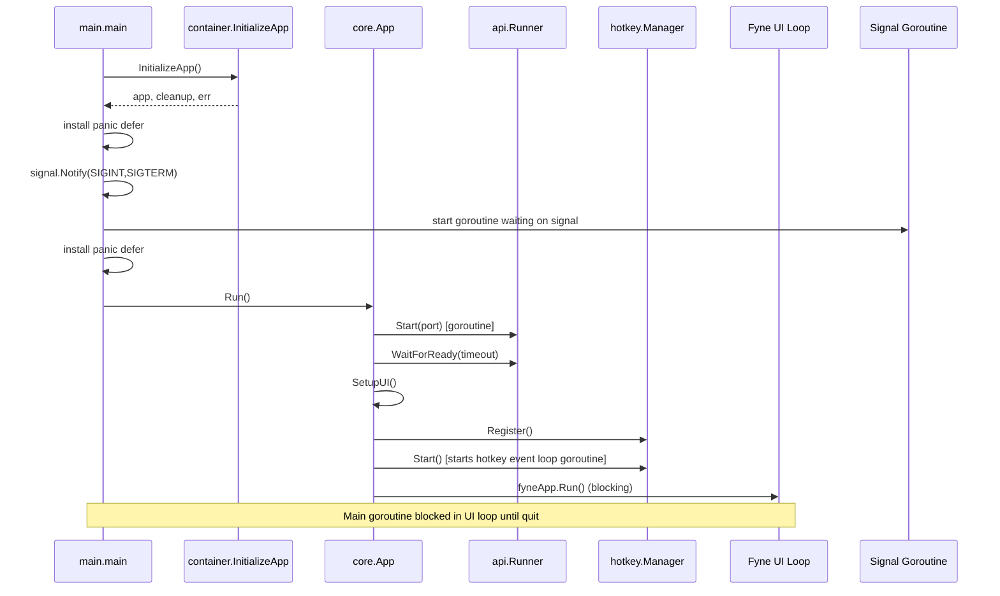
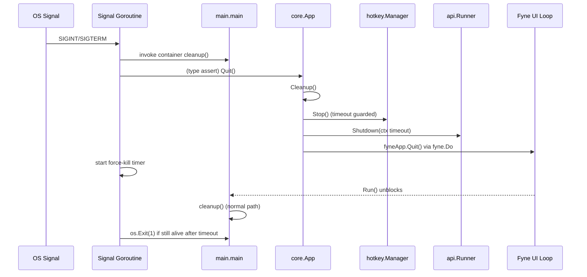

# Runtime Lifecycle Baseline (WP01)

## Scope
This baseline captures the current startup/shutdown behavior before runtime-layer refactoring for mission `01JTJQJ6P3R8L7M2N9V4C6X1ZA`.

Analyzed components:
- `main.go`
- `internal/application/container`
- `internal/application/core/app.go`
- hotkey manager lifecycle (`internal/infrastructure/hotkey/manager.go`)
- UI lifecycle (`internal/infrastructure/gui/*`)
- API runner lifecycle (`internal/infrastructure/api/runner.go`, `internal/infrastructure/api/server.go`)
- cleanup and panic/exit handling paths

## Startup Sequence (Current State)

### Step-by-step
1. `main.main` calls `container.InitializeApp()`.
2. DI/container returns:
   - `core.Application` implementation (`*core.App` at runtime)
   - aggregated `cleanup func()`
   - optional error
3. If init fails, `main` prints error and exits with status `1`.
4. `main` installs a panic-recovery `defer` (calls `cleanup()` then `os.Exit(1)`).
5. `main` installs OS signal handling (`SIGINT`, `SIGTERM`) using `signal.Notify`.
6. Signal goroutine is started:
   - waits on signal channel
   - calls `cleanup()`
   - type-asserts `myapp.(*core.App)` and calls `Quit()`
   - starts force-kill goroutine (`sleep ForceKillTimeout`, then `os.Exit(1)`).
7. `main` installs a second panic-recovery `defer` (duplicate panic exit flow).
8. `main` calls `myapp.Run()` (blocking call).
9. Inside `(*core.App).Run()`:
   - logs environment
   - starts API server via `apiRunner.Start()` (server runs in goroutine)
   - waits for API readiness (`WaitForReady(timeout)`)
   - sets up UI (`SetupUI`)
   - registers/starts hotkeys (`setupHotkey`)
   - calls `fyneApp.Run()` (blocks until app quit)
10. On GUI loop return, `core.App.Run()` logs shutdown and returns to `main`.
11. `main` calls `cleanup()` for normal completion.

### Startup sequence diagram

## Shutdown Sequence (Current State)

### Trigger paths
- OS signal (`SIGINT`, `SIGTERM`) received in signal goroutine.
- User-triggered quit from systray/menu (`core.App.Quit()` path).
- Normal return after `fyneApp.Run()` exits.
- Panic in `main` path (either defer).

### Step-by-step (signal-driven)
1. Signal goroutine receives signal.
2. Signal goroutine calls aggregated container `cleanup()`.
3. Signal goroutine type-asserts `myapp.(*core.App)` then calls `Quit()`.
4. `(*core.App).Quit()` calls `a.Cleanup()`:
   - hides quick-note window on UI thread (`fyne.DoAndWait`)
   - stops hotkey manager (with 500ms timeout)
   - shuts down API server with configured timeout
5. `Quit()` schedules `fyneApp.Quit()` via `fyne.Do`, waits up to 2s.
6. In parallel, signal goroutine starts force-kill timer and eventually calls `os.Exit(1)` if process still alive.
7. `fyneApp.Run()` returns; `main` reaches post-run `cleanup()` call (possible duplicate cleanup execution).

### Step-by-step (normal completion)
1. `fyneApp.Run()` returns (e.g., window closed/quit).
2. `core.App.Run()` returns to `main`.
3. `main` calls aggregated container `cleanup()`.

### Shutdown sequence diagram

## Lifecycle Owners (Current)
- `main.go`
  - process orchestration
  - signal handling
  - panic recovery wrappers
  - force-kill timeout/exit fallback
- `container.InitializeApp` (Wire-generated implementation from providers in `wire.go`)
  - construction of app graph
  - aggregation of provider cleanup callbacks
- `core.App`
  - app startup sequence (`Run`)
  - app-level cleanup (`Cleanup`)
  - app-level quit semantics (`Quit`)
- `api.Runner`
  - HTTP server goroutine start, readiness sync, graceful shutdown
- `hotkey.HotkeyManager`
  - global hotkey registration/start/stop and internal event-loop goroutine
- Fyne app/runtime
  - GUI loop lifecycle (`fyneApp.Run`, `fyneApp.Quit`)

## Cleanup Responsibilities (Current)
- Aggregated DI cleanup function from container/wire providers:
  - logger sync cleanup (`ProvideLogger` cleanup, with `*logger.ZapLogger` type assertion)
  - storage close cleanup (`ProvideUnifiedStorage` cleanup)
- `core.App.Cleanup()`:
  - quick-note UI hide on UI thread
  - hotkey manager stop with timeout
  - API runner shutdown with timeout
- `core.App.Quit()`:
  - calls `Cleanup()`
  - requests Fyne app quit on UI thread with timeout
- `main.go`:
  - explicitly invokes `cleanup()` on signal path and normal path
  - invokes `cleanup()` from panic defers

## Panic Recovery Points
- `main.go` defer #1: recover -> print -> `cleanup()` -> `os.Exit(1)`.
- `main.go` defer #2: recover -> print -> `cleanup()` -> `os.Exit(1)`.
- Request-level middleware recover exists in `internal/infrastructure/api/middleware.go` (HTTP request panic handling, not process lifecycle owner).

## `os.Exit` Call Sites (Lifecycle-Relevant)
- `main.go`
  - init failure path
  - panic defer #1
  - force-kill goroutine
  - panic defer #2
- `internal/infrastructure/logger/noop.go`
  - `NoopLogger.Fatal()` calls `os.Exit(1)` (not in main lifecycle flow, but process-terminating behavior exists).

## Type Assertions in Lifecycle Path
- `main.go`: `myapp.(*core.App)` in signal handler to call `Quit()`.
- `internal/application/container/container.go`: `app.(*core.App)` to extract logger/store.
- `internal/application/container/wire.go` cleanup: `log.(*logger.ZapLogger)` before `Sync()`.

## Blocking Calls and Long-Running Loops
- Blocking:
  - `myapp.Run()` from `main` (until app exits).
  - `fyneApp.Run()` in `core.App.Run()` (main UI loop; primary process blocker).
  - `api.Server.Start()` -> `ListenAndServe()` (blocking inside runner goroutine).
  - `apiRunner.WaitForReady(timeout)` blocks startup until ready/timeout.
  - `core.App.Quit()` waits up to 2s for quit completion.
  - `core.App.Cleanup()` waits for hotkey stop (up to 500ms) and API shutdown (config timeout).
- Long-running loops/goroutines:
  - Signal goroutine waiting on `sigChan`.
  - Hotkey event loop goroutine in `HotkeyManager.Start()` (`runHotkeyEventLoop` polling channels).
  - API server goroutine started by `apiRunner.Start()`.
  - Force-kill timer goroutine started on signal path.

## Observed Baseline Risks (to address in later WPs)
- Lifecycle control split across `main` and `core.App` with duplicate responsibility boundaries.
- Duplicate panic recovery defers in `main`.
- Multiple `os.Exit` paths before final process return point.
- Type assertions indicate missing lifecycle abstraction boundary.
- Cleanup can run from multiple paths (signal, panic, normal completion), raising idempotency pressure.

## Runtime Skeleton Mapping
The new `internal/runtime` package introduced in WP02 establishes the future ownership boundary that will replace lifecycle responsibilities currently in `main.go`.

Planned mapping:
- `main.go` current orchestration role -> future `runtime.Run(...)` entrypoint.
- manual signal wiring (`signal.Notify`) -> future runtime signal/context integration (`signals.go` placeholder).
- ad hoc shutdown sequencing across `main` and `core.App` -> future coordinated runtime shutdown flow (`shutdown.go` placeholder).
- concrete app coupling and type assertions -> future lifecycle interface contract (`lifecycle.go`).

WP02 is scaffold-only:
- no lifecycle logic moved yet
- no behavioral changes yet
- runtime files currently define interfaces, placeholders, and TODO boundaries only
